Commerce Extended Quantity
==========================

Allows to set quantity field's **default_value**, **step**, **min**, **max**,
**prefix** and **suffix** on a form display widget. Additionally, validates user
input on the field and order item's quantity availability both on
an *Add to cart* form and quantity update field in a *Shopping cart*. Also,
allows to disable quantity field for a given order item type on
the [cart#](#0 "Shopping cart page"). More info could be found on
the [Extended Number Field ↗](https://github.com/drugan/xnumber) module's page,
on top of which the current module is built. Also, the
submodule [Commerce Extended Quantity Stock ↗](https://github.com/drugan/commerce_xquantity/tree/8.x-1.x/modules/xquantity_stock) can
be enabled to manage product variation stock.

> Tip: you can see this file in your browser by clicking
the [admin/help#](#0 "? Help") link at the right of the *Admin toolbar* and then
the [admin/help/commerce_xquantity#](#0 "Commerce Extended Quantity") link in
the list.

The module was created as a solution for the following *Drupal Commerce* issues:

- [Issue \#2794909: The quantity "step" must be configurable on the widget level ↗](https://www.drupal.org/node/2794909)
- [Issue \#2861983: Improve cart behavior when the quantity is 0 or an empty string ↗](https://www.drupal.org/node/2861983)
- [Issue \#2819041: Quantity limit in Shopping Cart ↗](https://www.drupal.org/node/2819041)
- [Issue \#2903504: Add form validations in Cartform and in AddToCartForm ↗](https://www.drupal.org/node/2903504)
- [Issue \#2892207: Increase the default order item quantity precision ↗](https://www.drupal.org/node/2892207)
- [Issue \#2891190: Updating multiple products in cart \- breaks the cart ↗](https://www.drupal.org/node/2891190)

________________________________________________________________________________

- [admin/help/commerce_xquantity#setup](#setup "Setup")
- [admin/help/commerce_xquantity#disable-on-cart](#disable-on-cart "Disable on cart")
- [admin/help/commerce_xquantity#important-notes](#important-notes "Important notes")
- [admin/help/commerce_xquantity#empty-string-or-0-quantity](#empty-string-or-0-quantity "Empty string or 0 quantity")
- [admin/help/commerce_xquantity#quantity-vs-items-quantity](#quantity-vs-items-quantity "Quantity vs items quantity")
- [admin/help/commerce_xquantity#quantity-price-adjustments](#quantity-price-adjustments "Quantity price adjustments")
- [admin/help/commerce_xquantity#an-item-added-to-your-cart-message-alter](#an-item-added-to-your-cart-message-alter "An Item added to your cart message alter")
- [admin/help/commerce_xquantity#module-author](#module-author "Module author")
- [Commerce Extended Quantity on drupal.org ↗](https://www.drupal.org/project/commerce_xquantity)
- [Commerce Extended Quantity on github.com ↗](https://github.com/drugan/commerce_xquantity)

________________________________________________________________________________


## Setup

If you want to expose *quantity* field for a customer on the *Add to cart* form,
then go to
the [admin/commerce/config/order-item-types/default/edit/form-display/add_to_cart](#0 "Default order item") page
and enable *Quantity* field on the respective form display mode. The default
order item type is taken as an example. Actually, might be any order item.


The quantity widget settings' summary explained:

- **default value:** The quantity to pre-fill on an *Add to cart* form by
default.
- **step:** The main setting of the field. Defines the allowed amount to
increment or decrement the field value with. So, the value entered must be an
exact multiple of the amount. The setting also defines a sub-type of the field.
For example, If you set it to an integer value then the field  becomes integer
despite being initially decimal field with precision *14,4*. No decimal values
will be accepted for the field. The same with decimal *step*. If you set it, for
example to *0.5*, then no decimal values like *0.05* or *0.005* or *0.0005* will
be accepted despite the initial decimal part of the field can be up to 4 digits.
However, the *1* or *2* or *99* are valid input values because these numbers are
multiples of the *0.5* step. For the most common set up you might set it to *1*.
If you sell, for example, t-shirts but want your customers add to cart only even
quantities, then you might set it to *2* and force them to
buy *2* or *4* or *98* but not *1* or *3* or *99* t-shirts.
- **min:** The minimal value allowed. Use it to force customers for buying no
less than the value. Should be the multiple of the *step* and no greater than
the *max* property.
- **max:** The maximum value allowed. Should be the multiple of
the *step* and no less than the *min* property. Use it to restrict customers on
the order item quantity to buy.
- **prefix:** The text appearing before the quantity field.
- **suffix:** The text appearing after the quantity field.
- **placeholder:** The text appearing inside the empty quantity field.
- **disable_on_cart:** Whether to disable field in a Shopping cart for the given
order item type.
- **base_default_value:** The value defined for the field in code (*1*).
- **base_step:** The calculated value which is the minimal step for the
decimal field with the precision *14,4* (*0.0001*).
- **floor:** The most possible minimal positive value for the field (*0*). Note
that this value is overriden by the *step* property, which must be greater
than *0* by its nature.
- **ceil:** The most possible maximum value for the decimal field with the
precision *14,4* (*9999999999.9999*).

To change the settings displayed on the widget summary click on the gear icon at
the right of the summary. If you don't want to expose *quantity* field for a
customer on the *Add to cart* form but still require non-default settings for
the field then do the same settings on the *Default* form mode's form display
widget.


## Disable on cart

There might be cases when a customer should be disallowed to update quantity in
a *Shopping cart*. For example, you did not exposed the field on
an *Add to cart* form supposing the default quantity to be added or, the field
is exposed but you disallow the customer to change their mind on the cart page.
So, they have just two options: either to continue with checkout or remove order
item from a cart. Arguably, this workflow may increase sales rate.

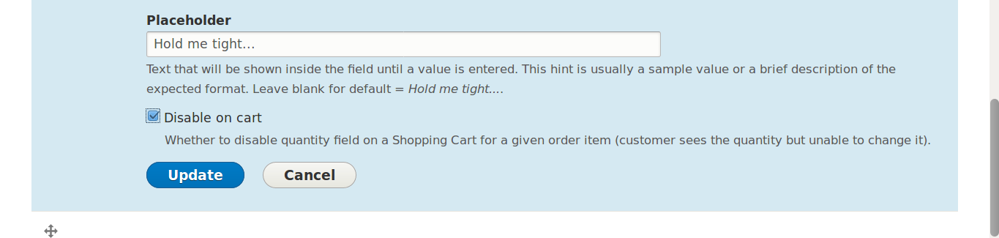
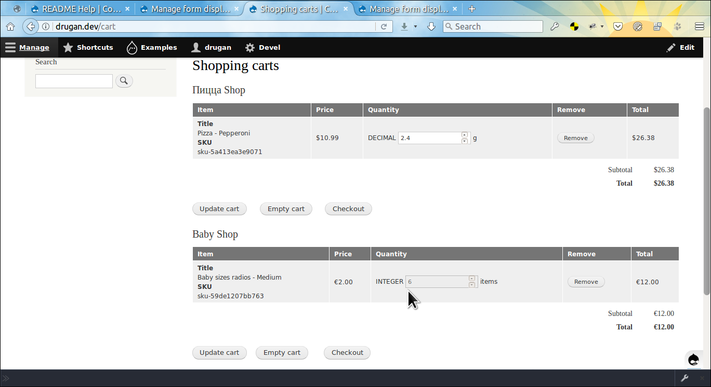

## Important notes

###### Settings workflow
> When saving the *Xnumber field* widget's settings it is recommended to do it
with the multi-step workflow. First, set and save the *Step* property of the
quantity field which is the definitive setting for all the rest numeric
properties. Then, using the controls at the right of the *Minimum* property
field set the desirable value (optional). Save it. After that, you may set
the *Maximum* property (optional). And finally, set the *Default value* which
will be pre-filled for a customer on an *Add to cart* form or quantity update
field in a *Shopping cart* table (optional). The same with changing the earlier
saved *Step* property. First, set blank for
the *Default value*, *Minimum* and *Maximum* properties and then repeat the
above procces. Later, when you grasp how the module works you can set it up in
one go without getting error messages on an attempt to save a wrong value.


###### Empty string or 0 quantity
> As the quantity field is not required a customer may empty the field and try
to submit the form. On the *Add to cart* form an error will be emitted with the
minimal value allowed to submit to a customer. On the *Shopping cart* table it
just removes the order item from the cart. The same approach is taken with an
attempt to submit a *0* quantity (if the *min* property is not set).

## Quantity vs items quantity

The *Commerce Extended Quantity* module introduces a new notion of the order
item quantity:

`QUANTITY = NUMBER_OF_ITEMS ^ NUMBER_OF_UNITS`

Where **ITEM** is any separate item that must be measured in integer value
== *1*. Where **UNIT** is any non-zero unit of the **ITEM** that must be
measured in decimal up to *4* digits after decimal sign and where one and only
one **ITEM** is a set of multiple **UNITS**.

Another words, if you have *1.999 g* of pizza in your *Shopping cart* then it is
considered as *1* item with the quantity of *1.999*. If you have *2.000 g* of
the pizza then it is the same: *1* item with the quantity of *2.000*. But if
the *step* on the quantity field is integer and the quantity in
the *Shopping cart* is *2*, then it is considered as two separate items with the
quantity of *2*.

The *Drupal Commerce* experts should not be scared by the approach above because
the only place where it is implemented is the *Shopping cart block*, where
quantities displayed differently for the fields having integer or
decimal *step*.

@PHPFILE: modules/contrib/commerce_xquantity/src/Plugin/Block/XquantityCartBlock.php LINE:46 PADD:5 :PHPFILE@

All the rest code such as price or tax calculation has no any impact with the
notion and as usual uses this method:

```
$quantity = $order_item->getQuantity();
```

The current *Drupal Commerce* module forcibly casts decimal quantity in
the *Shopping cart block* to integer value which is confusing and might mislead
a customer:

```
$count += (int) $order_item->getQuantity();
```

However, with the *Commerce Extended Quantity* module you may encounter the
following quantities in the *Shopping cart block*:

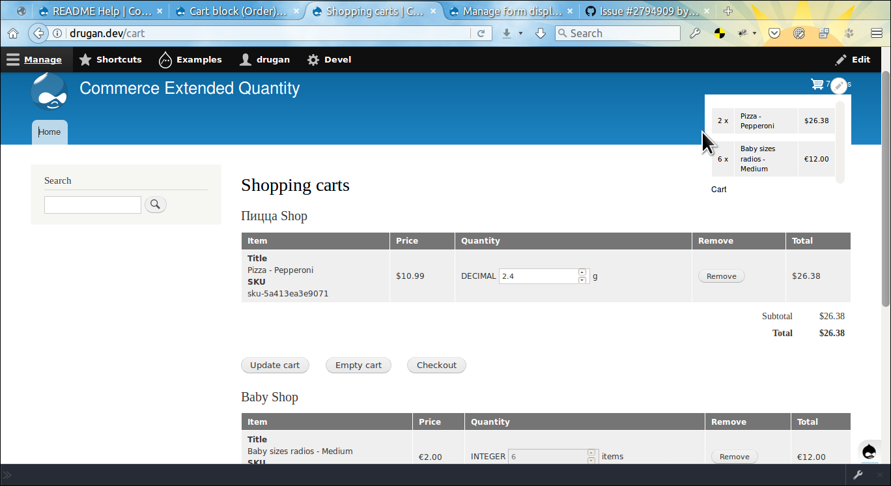

Again, the decimal quantity is truncated in the block. To mitigate the issue go
to the [admin/structure/views/view/commerce_cart_block](#0
"Cart block view") page, open *order item: Quantity* for editing and do the
following changes:

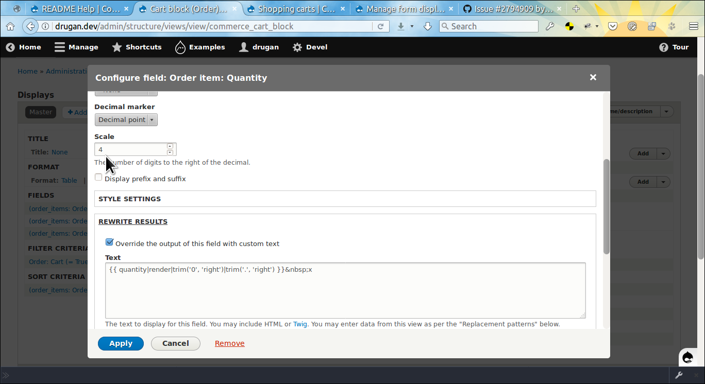

And you'd get this:

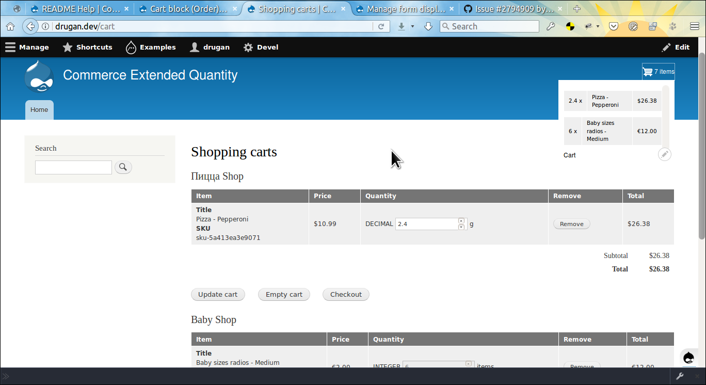

## Quantity price adjustments

The module allows to adjust order item price depending on its quantity.

First, set required number of quantity ranges and save the widget settings.
After that set the quantity _start_ which is the only required field on a range.
Optionally set additional conditions for this quantity price adjusment to be
applied. If the _Price list_ checkbox is checked and the respective price exist
then this price will be applied instead of a regular variation price.

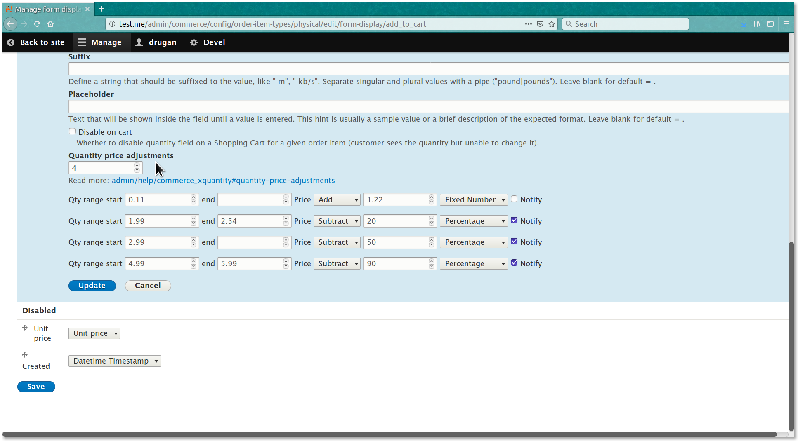

### Adjusments explained

Starting from the minimum quantity for this order item type
(means: _any_ quantity) add `0.99` to each variation price of
the *physical_var* type. Apply this adjustment on _Friday_s and _Sunday_s
until `22:00 PM` in case if a user is _anonymous_ and stop running it right
before the beginning of the 2020 year. Do **NOT** notify user about this
adjustment:

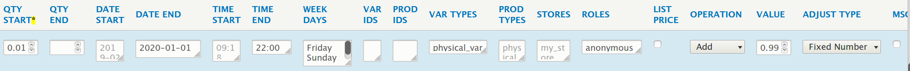

With the quantity `1.02` through `4.99` subtract `10%` from the price of each
variation on products having `123` or `456` ID in case if a user
is _authenticated_. Start this adjusment today at `08:30 AM` and run it forever.
Notify user about this adjusment:

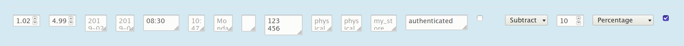

Starting from the `3.45` quantity subtract `50%` from the price of each product
variation belonging to the *my_store* store. Run this adjusment forever from
the `1st March 2019`. Notify user about this adjusment:

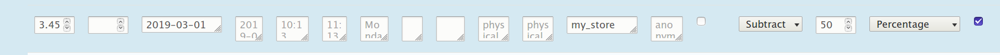

Starting from the `1.23` quantity apply _List price_ for the variations
having `1234` or `5678` ID and do **NOT** adjust this price. Run this adjusment
from `11:30 AM` to `14:00 PM` on _Monday_ s and _Thursday_ s for
a *privileged_buyer*. Notify user about this adjusment:

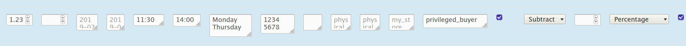

The quantity price adjustment messages display all required info for a customer
in order to help them to get a great deal: the quantity to add
to a _Shopping cart_ and the price that will be charged for each order item:

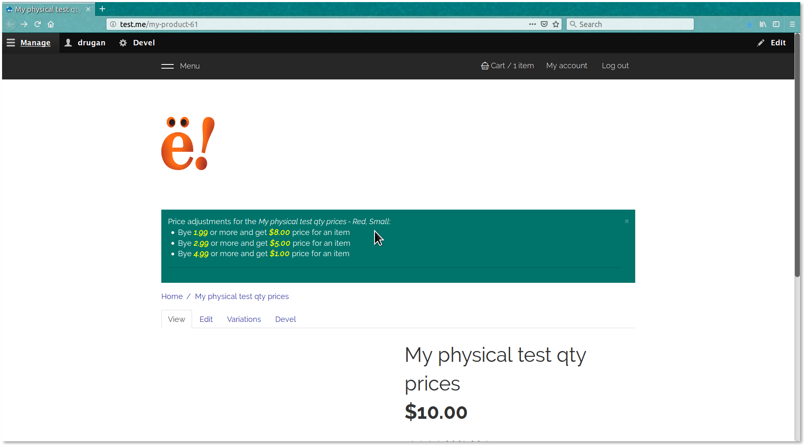

## Quantity price adjustment settings


###### QTY START

The only  field which is **required**. The `step`, `min` and `max` settings of the field are synced with the respective
quantity field settings. To apply an adjustment for _any_ quantity in
a _Shopping cart_ set  for this field the `min` value and leave
the _QTY END_ field empty.

--------------------------------------------------------------------------------

###### QTY END

This field `step`, `min` and `max` settings are synced with the respective
quantity field settings. Note that if this field has for example, the
value `1.05` and the next adjustment _QTY START_ field has the value `1.50` then
product variation quantities `1.06` through `1.49` are **NOT** covered by any of
the adjustments and will be added to a _Shopping cart_ using the original price.
Hence, if a customer already has an order item with the `1.05` quantity and got
a lower price for this item then increasing the quantity to `1.06` the order
item price and its total will be recalculated with the original order item unit
price.

--------------------------------------------------------------------------------

###### DATE START

The date to start an adjustment with. Should be in the `YEAR-MONTH-DAY` format.
See an example value in the field's placeholder. This field does **NOT** need
if you want to start your adjustment on the current day. The field might be
useful for automatically starting an adjusment on some day in the future. Can be
used together with the _TIME START_ and / or _WEEK DAYS_ fields to get a more
granular adjusment runtime condition settings.

--------------------------------------------------------------------------------

###### DATE END

The date to end an adjustment with. Stops all other date / time settings on an
adjustment. So, if you set `2020-01-01` value for this field then starting from
this date the adjustment will **NOT** run anymore.

--------------------------------------------------------------------------------

###### TIME START

The time of the day to start an adjustment with. Must be in a 24-hours time
format with leading zeroes. See an example value in the field's placeholder. You
do **NOT** need this field if you want to start an adjustment right now. Might
be used with the _TIME END_ field to run the adjustment on a particular time
range or with _DATE START_ and / or _WEEK DAYS_ fields to get a more
granular adjusment runtime condition settings.

--------------------------------------------------------------------------------

###### TIME END

The time to end an adjustment with disregarding of other date / time settings.
Might be used with the _TIME START_ field to run the adjustment on a particular
time range or with _DATE END_ and / or _WEEK DAYS_ fields to get a more
granular adjusment runtime condition settings. For example, if you set for
the _DATE END_ `2020-01-01` value then it stops
right **BEFORE** the _`New Year`_ but if you add `13:00` value for
the _TIME END_ field then it will stop on the 31st of December 2019 exactly on
this time.

--------------------------------------------------------------------------------

###### WEEK DAYS

The day(s) of the week to run an adjustment on. Have to be the English name of a
day. See an example value in the field's placeholder. For multiple values insert
one value on each line. Might be used together with any of the date / time
fields.

--------------------------------------------------------------------------------


###### VAR IDS

The variation ID(s) to make price adjustment for. For multiple values insert
one value on each line. Note that variations have to be of a type which is
bundled with the current order item type. A variation ID can be found by
visiting parent **product/NNN/variations** page, then clicking on
the **`Edit`** button at the right of the variation and copying the value from
a browser address bar:

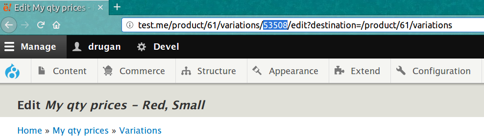

--------------------------------------------------------------------------------

###### PROD IDS

The product ID(s) to make price adjustment for **ALL** its variations. For
multiple values insert one value on each line. Note that a product have to be
bundled with this type variation which in its turn is bundled with the current
order item type. A product ID might be found from a browser address bar by
visiting its page or its variation(s) edit page. See the image above:
the **61** is the product ID.

--------------------------------------------------------------------------------


###### VAR TYPES

The variation type(s) to make price adjustment for. For multiple values insert
one value on each line. The types available for the current order item type
might be seen from the field placeholder.

###### PROD TYPES

The product type(s) to make price adjustment for **ALL** its variations. For
multiple values insert one value on each line. The types available for the
current order item type might be seen from the field placeholder.

--------------------------------------------------------------------------------

###### STORES

The store type(s) to make price adjustment for **ALL** its product variations.
For multiple values insert one value on each line. The types available for the
current order item type might be seen from the field placeholder. Note that an
admin should on their own to decide whether this particular store type has
products pertaining to the current order item type.

--------------------------------------------------------------------------------

###### ROLES

The user role(s) to make price adjustment for. For multiple values insert one
value on each line. The roles available might be seen from the field
placeholder. Note that because the information on this field might open
security vulnerability a user in order to have access to this field's
placeholder value must have _`administer users`_ permission.

--------------------------------------------------------------------------------

###### LIST PRICE

Whether to apply _List price_ instead of a regular variation price on this
adjustment. Note if the field does not exist then the regular price will be
applied.

--------------------------------------------------------------------------------

###### OPERATION

Whether to add or subtract the adjustment value from a price.

--------------------------------------------------------------------------------

###### VALUE

The value to use for a price recalculation.

--------------------------------------------------------------------------------

###### ADJUST TYPE

Whether the value above should be deemed as a _Fixed value_ or a _Percentage_.

--------------------------------------------------------------------------------

###### NOTIFY

Whether to display a message with an adjustment data to help a customer to
take the right decision on an _Add to cart_ and / or _Shopping cart_ pages. See
the image above.

--------------------------------------------------------------------------------


The quantity price adjustments defined on an order item type widget can be
changed dynamically by implementing
the **HOOK_xquantity_add_to_cart_qty_prices_alter()**. For example, you can
remove adjustments for some product or variation type based on your custom
condition or change the adjusment data before applying that to an order item.
Or, just set the minimum quantity on the _QTY START_ field and leave all the
rest fields empty in order to use an adjustment as a trigger and then apply your
own bussiness logic in the _hook_:

********************************************************************************

@PHPFILE:  commerce_xquantity.module LINE:53 PADD:10 :PHPFILE@

********************************************************************************

The same with the quantity price adjusment messages which could be changed or
removed in the **HOOK_xquantity_add_to_cart_qty_prices_msg_alter()**. See an
example:

********************************************************************************

@PHPFILE:  commerce_xquantity.module LINE:73 PADD:4 :PHPFILE@

********************************************************************************

## An Item added to your cart message alter

If you want to alter or remove the message shown to a customer when an order
item is added to a _Shopping cart_ then implement
the **HOOK_xquantity_added_to_cart_msg_alter()**. See the example in
the *commerce_xquantity.module* file:

********************************************************************************

@PHPFILE:  commerce_xquantity.module LINE:35 PADD:8 :PHPFILE@

********************************************************************************

## Have a good sales' quantity!

###### Module author:
```
  Vlad Proshin (drugan)
  [proshins@gmail.com](proshins@gmail.com)
  [https://drupal.org/u/drugan](https://drupal.org/u/drugan)
```
